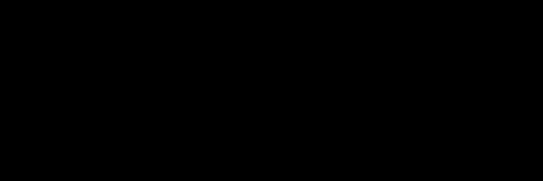

[](https://github.com/miykael/gif_your_nifti/issues/)
[](https://github.com/miykael/gif_your_nifti/pulls/)
[](https://GitHub.com/miykael/gif_your_nifti/graphs/contributors/)
[](https://github.com/miykael/gif_your_nifti/commits/master)
[](https://github.com/miykael/gif_your_nifti/archive/master.zip)

# Gif your nifti
Create nice looking gifs from your nifti (`.nii` or `.nii.gz`) files with a simple command:

```
gif_your_nifti /path/to/data.nii
```


# Getting started

## Dependencies

| Package                                   | Tested version |
|-------------------------------------------|----------------|
| [NumPy](http://www.numpy.org/)            | 1.14.2         |
| [NiBabel](http://nipy.org/nibabel/)       | 2.2.1          |
| [matplotlib](http://matplotlib.org/)      | 2.2.0          |
| [imageio](https://imageio.github.io/)     | 2.2.0          |
| [scikit-image](https://scikit-image.org/) | 0.13.0         |

## Installation

Navigate to the main page of the repository and clone it. Then, change directory to the cloned repository and run:
```
pip install -r requirements.txt
python setup.py install
```

## Docker

Build a docker container with:

```
docker build -t gif_your_nifti .
```

Run with docker:

```
docker run --rm -v /path/to/nifti/:/data gif_your_nifti:latest /data/image.nii
```

## Examples

For the examples below, I've downloaded [ICBM 2009c Nonlinear Asymmetric](http://www.bic.mni.mcgill.ca/~vfonov/icbm/2009/mni_icbm152_nlin_asym_09c_nifti.zip) and used the T1 and gray matter template thereof.

It is also possible to use your own brain image, as I will show below. The only thing that you need to make sure is, that your brain image has the right orientation. You can reorient your NIfTI image according to the MNI template standard with the FSL command: `fslreorient2std my_brain.nii my_brain.nii`.

### Grayscale GIF

To create a simple gray scale gif, type the following command in your commandline:

```
gif_your_nifti /path/to/mni_icbm152_t1_tal_nlin_asym_09c.nii
```


### Pseudocolor GIF

To create a [pseudocolor](https://en.wikipedia.org/wiki/False_color#Pseudocolor) gif, type the following command in your commandline:
```
gif_your_nifti /path/to/Me_2014.nii --mode pseudocolor --cmap plasma
```


The colormap can be any colormap from the [matplotlib colormaps](https://matplotlib.org/examples/color/colormaps_reference.html).

### Depth GIF

To create a depth gif, type the following command in your commandline:

```
gif_your_nifti /path/to/mni_icbm152_t1_tal_nlin_asym_09c.nii --mode depth
```


The image shows you in color what the value of the next slice will be. If the color is slightly red or blue it means that the value on the next slide is brighter or darker, respectifely. It therefore encodes a certain kind of depth into the gif.


### RGB GIF

To create a Red Blue Green (RGB) gif, type the following command in your commandline:

```
gif_your_nifti /path/to/gm.nii /path/to/wm.nii /path/to/csf.nii --mode rgb
```


This image takes the values from the first NIfTI file as its red colors, second NIfTI file as its green colors and third NIfTI as its blue colors.


## Resize GIF

It is also possible to change the size of a gif, by changing the `size` parameter in any function above. The following are examples of resizing the images to 50% of it's original size, with:


```
gif_your_nifti /path/to/mni_icbm152_gm_tal_nlin_asym_09c.nii --size 0.5
gif_your_nifti /path/to/mni_icbm152_gm_tal_nlin_asym_09c.nii --size 0.5 --mode pseudocolor --cmap cubehelix
gif_your_nifti /path/to/mni_icbm152_gm_tal_nlin_asym_09c.nii --size 0.5 --mode pseudocolor --cmap inferno
gif_your_nifti /path/to/mni_icbm152_gm_tal_nlin_asym_09c.nii --size 0.5 --mode pseudocolor --cmap viridis
```


Changing the size of a gif also changes the frames per second parameter, so that the overall tempo stays the same. Meaning, if you have a gif of original size with 20 frames per second (fps), changing the size to 50%, will cause the smaller gif to run at 10 fps, so that both take the same amount for a cycle.

### Use within a python script

You can also use `gif_your_nifti` from a python script. See [script examples](examples/example_script.py) for further information.

# License

This project is licensed under [BSD 3-Clause License](LICENSE.md).
